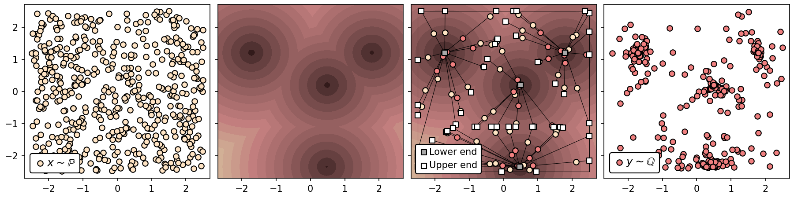
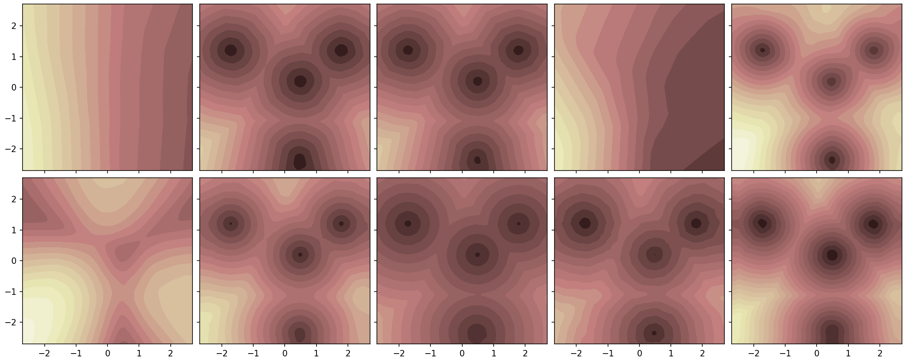
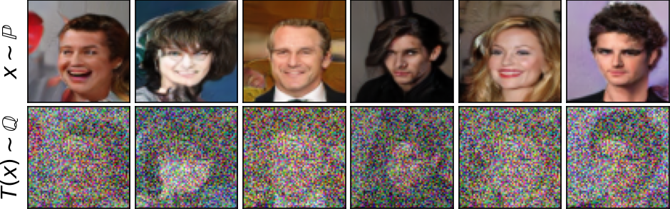
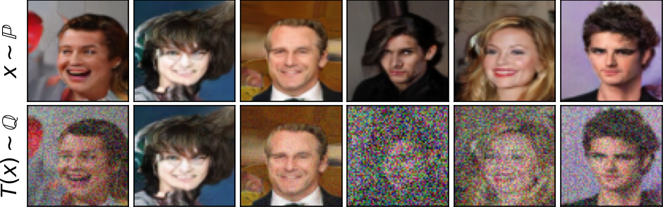
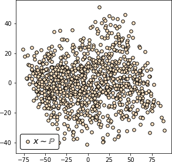
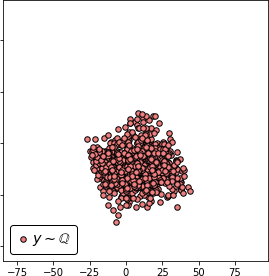
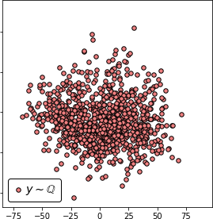

# Continuous Wasserstein-1 Benchmark
This is the official `Python` implementation of the benchmark paper **Kantorovich Strikes Back! Wasserstein GANs are not Optimal Transport?** by [Alexander Korotin](https://scholar.google.ru/citations?user=1rIIvjAAAAAJ&hl=en), [Alexander Kolesov](https://scholar.google.com/citations?user=vX2pmScAAAAJ&hl=ru&oi=ao)  and [Evgeny Burnaev](https://scholar.google.ru/citations?user=pCRdcOwAAAAJ&hl=ru).

The repository contains a set of continuous benchmark distributions for testing optimal transport (OT) solvers with the distance cost (the Wasserstein-1 distance, W1), the code for a dozen of WGAN dual OT solvers and their evaluation.

 
## Pre-requisites
The implementation is GPU-based. Single GPU GTX 1080 ti is enough to run each particular experiment. We tested the code with `torch==1.10.2`. The code might not run as intended in older/newer `torch` versions.

## Related repositories
- [Repository](https://github.com/iamalexkorotin/Wasserstein2Benchmark) for [Do Neural Optimal Transport Solvers Work? A Continuous Wasserstein-2 Benchmark](https://openreview.net/forum?id=CI0T_3l-n1) paper.

## Repository structure
- `notebooks/` - jupyter notebooks with preview of benchmark pairs and the evaluation of OT solvers;
- `src/` - auxiliary source code for the OT solvers and the benchmark pairs;
- `metrics/` - results of the evaluation (cosine, L2, W1);
- `benchmarks/` - `.pt` checkpoints for continuous benchmark pairs.
- `checkpoints/` - `.pt` fitted dual potentials of OT solvers for the 2-dimensional experiment with 4 funnels.

## Intended usage
Our benchmark pairs of distributions are designed to be used to test how well OT solvers recover the OT cost (W1) and the OT gradient. Use the following code to load the pairs and sample from them (assuming you work in `notebooks/`):
```python
import sys
sys.path.append("..")

from src.map_benchmark import MixToOneBenchmark, Celeba64Benchmark

# Load the high-dimensional benchmark for dimension 16 (2, 4, ..., 128)
#for number of funnels 64(4, 16, 64, 256)
benchmark =  MixToOneBenchmark(16,64)

# OR load the images benchmark pair 
# for number of funnels 16 (1,16), degree 10 (10, 100) correspondingly
# benchmark = Celeba64Benchmark( 16, 10)

# Sample 32 random points from the benchmark distributions (unpaired, for training)
X = benchmark.input_sampler.sample(32)
Y = benchmark.output_sampler.sample(32)

# Sample 32 random points from the OT plan (paired, for testing only)
X, Y = benchmark.input_sampler.sample(32 ,flag_plan=True)
```
The examples of testing OT solvers are in `notebooks/` folder, see below.

## Evaluation of Existing WGAN OT Solvers
We provide all the code to evaluate existing dual WGAN OT solvers on our benchmark pairs. The qualitative results are shown below. For quantitative results, see the paper or `metrics/` folder.

### High-Dimensional Benchmarks
- `notebooks/get_benchmark_nd.ipynb` -- previewing benchmark pairs;
- `notebooks/test_nd.ipynb` -- testing dual WGAN OT solvers.

The scheme of the proposed method for constructing benchmark pairs.

<p align="center"></p>

The surfaces of the potential learned by the OT solvers in the 2-dimensional experiment with 4 funnels.

<p align="center"></p>

### Images Benchmark Pairs 
- `notebooks/get_benchmark_celeba.ipynb` -- previewing benchmark pairs;
- `notebooks/test_celeba.ipynb` -- testing dual WGAN OT solvers.

<p  align="center">
  
   
</p>

 
<p  align="center">
  
    
   
</p>
 
## Credits
- [CelebA page](http://mmlab.ie.cuhk.edu.hk/projects/CelebA.html) with faces dataset;
- [UNet architecture](https://github.com/milesial/Pytorch-UNet) for the mover;
- [ResNet architectures](https://github.com/harryliew/WGAN-QC) for the generator;
- [DC-GAN architecture](https://pytorch.org/tutorials/beginner/dcgan_faces_tutorial.html) for the discriminator;
- [Geotorch package](https://github.com/Lezcano/geotorch) for weight orthgonalization in SO solver;
- [Gradient Penalty](https://github.com/EmilienDupont/wgan-gp) for the regularization in GP solver;
- [Spectral Normalization](https://github.com/christiancosgrove/pytorch-spectral-normalization-gan) for the parametrization of SN solver;
- [Sorting Out](https://github.com/cemanil/LNets) for the group sort activations in SO solver.
 
